# AgriConnect

**A role-based agricultural marketplace for farmers, buyers, agri-experts, and administrators.**

AgriConnect is a Java web application that digitizes produce listing, buyer bidding, MSP compliance, farmer-buyer matchmaking, FPO pooling, advisory alerts, and order tracking for agricultural supply-chain workflows. The project is built as a traditional Spring MVC + JSP + Hibernate application, packaged as a WAR, and designed to run locally with Docker Compose using MySQL and Tomcat.


## Portfolio Summary

**Repository description:** Full-stack Java Spring MVC marketplace for agricultural trade, featuring Hibernate ORM, MySQL, JSP dashboards, JWT APIs, role-based access control, and Docker deployment.

**One-line summary:** Built a production-style Java MVC platform that connects farmers and buyers through MSP-aware listings, secure bidding, smart matchmaking, advisory alerts, and admin compliance tools.

**Suggested subtitle:** Intelligent Agricultural Trade and MSP Compliance Platform

## Project Overview

AgriConnect models a real agricultural procurement workflow:

1. Farmers register, create produce listings, upload listing photos, track bookings, manage FPO participation, and view earnings.
2. Buyers search marketplace listings, place bids, accept counter-offers, track orders, and view ranked bid positions.
3. Agri-experts publish crop, weather, disease, market, and pest advisories that notify relevant farmers.
4. Administrators verify users, manage MSP rates, review below-MSP listings, inspect audit logs, and monitor operational metrics.
5. Scheduled services recompute farmer scores, expire stale listings, and refresh matchmaking scores.

The application demonstrates layered Java backend engineering with controllers, services, DAOs, DTOs, validation, transaction management, authentication, and relational database design.

## Key Features

| Area | Implemented Capability |
| --- | --- |
| Authentication | Form login for JSP pages, JWT login for REST APIs, BCrypt password hashing, role-aware usernames using `email|ROLE` |
| Role-Based Access | Farmer, Buyer, Admin, and Agri-Expert authorization through Spring Security XML and method-level `@PreAuthorize` rules |
| Marketplace | Public listing search, listing details, crop/district/price/quality filters, listing status lifecycle |
| Farmer Workflow | Create listings, withdraw/reactivate listings, upload photos, manage bookings, accept/reject/counter bids, update delivery status |
| Buyer Workflow | Browse listings, place bids, accept counter-offers, view orders and receipts |
| MSP Compliance | Current-season MSP lookup, below-MSP detection, MSP checker page, admin compliance dashboard |
| Smart Matchmaking | Farmer-buyer scoring using crop overlap, proximity via Haversine distance, and historical delivered orders |
| Farmer Scoring | Scheduled recomputation of farmer performance scores from delivery and quality signals |
| FPO Module | Farmer Producer Organization group creation, membership requests, leader approval, collective crop listings |
| Advisories | Agri-expert advisory publishing, severity levels, critical alerts, async bulk notifications to affected districts/crops |
| Notifications | Web and REST notification APIs with read/unread tracking |
| Earnings | Farmer earnings summary based on delivered orders and wallet-credit records |
| Auditing | Admin-visible audit logs for important marketplace actions |
| Operations | Dockerized Tomcat app, MySQL container, Adminer, health and readiness endpoints |

## Tech Stack

| Layer | Technology |
| --- | --- |
| Language | Java 17 |
| Web Framework | Spring Framework 6.1, Spring MVC |
| Security | Spring Security 6.2, BCrypt, JWT (`jjwt`) |
| Persistence | Hibernate ORM 6.4, Hibernate Transaction Manager, HikariCP |
| Database | MySQL 8.3, H2 for tests |
| Views | JSP, JSTL, Spring Security taglibs, Bootstrap 5 |
| API Serialization | Jackson Databind with Java Time module |
| Build | Maven, WAR packaging, Maven Surefire/Failsafe, JaCoCo |
| Runtime | Apache Tomcat 10.1, Jakarta Servlet 6 |
| DevOps | Docker, Docker Compose, Render config, Railway/deployment helper scripts |
| Testing | JUnit 5, Mockito, AssertJ, Spring Test, MockMvc, Spring Security Test |

## Architecture

AgriConnect follows a layered Spring MVC architecture:

```text
Browser / REST Client
        |
        v
Spring MVC Controllers / REST Controllers
        |
        v
Service Layer
        |
        v
DAO Layer
        |
        v
Hibernate SessionFactory
        |
        v
MySQL Database
```

### MVC Layer

- `DispatcherServlet` is configured in `src/main/webapp/WEB-INF/web.xml`.
- Controller scanning is configured in `WEB-INF/spring/mvc-context.xml`.
- JSP views are resolved from `WEB-INF/views/` through `InternalResourceViewResolver`.
- Static assets are served through `/static/**`, `/resources/**`, and uploaded files through `/uploads/**`.

### Backend Layers

| Layer | Package | Responsibility |
| --- | --- | --- |
| Controllers | `com.agriconnect.controller` | JSP routes, dashboards, role-specific workflows, form submissions |
| REST Controllers | `com.agriconnect.rest` | JSON APIs for auth, listings, bids, orders, notifications, health |
| Services | `com.agriconnect.service` | Business logic, validation, transaction boundaries, scoring, bidding, advisories |
| DAOs | `com.agriconnect.dao` | Hibernate queries and persistence operations |
| Models | `com.agriconnect.model` | JPA entities mapped to relational tables |
| DTOs | `com.agriconnect.dto` | Request/response models for APIs and forms |
| Security | `com.agriconnect.security` | JWT, user details, login identity, rate limiting, encryption |
| Validation | `com.agriconnect.validation` | Aadhaar and date-range validation |
| Configuration | `com.agriconnect.config` and XML files | Security, scheduling, DB, MVC, logging |

### Security Architecture

The project uses two security modes:

- **Web session authentication:** JSP pages use form login at `/auth/login`, CSRF protection, session fixation protection, and one active session per user.
- **Stateless API authentication:** `/api/**` uses JWT authentication and disables CSRF for JSON API use.

Role access is enforced for:

- Farmer routes: `/web/farmer/**`, `/farmer/**`, selected `/api/v1/**`
- Buyer routes: `/web/buyer/**`, `/buyer/**`, bidding/order APIs
- Admin routes: `/web/admin/**`, `/actuator/metrics`
- Agri-expert routes: `/web/expert/**`, advisory publishing APIs

## Main Workflows

### Farmer Workflow

1. Register or log in as a farmer.
2. Create produce listings with crop, variety, quantity, price, date range, district, grade, and urgency metadata.
3. System attaches current MSP when available.
4. Buyers place bids.
5. Farmer accepts, rejects, or counters bids.
6. Accepted bids create orders, wallet credits, price-history records, and notifications.
7. Farmer tracks bookings, orders, profile, FPO activity, and earnings.

### Buyer Workflow

1. Browse the public marketplace.
2. Filter listings by crop, district, price range, and quality grade.
3. Open listing detail pages.
4. Place bids for available quantities.
5. Accept farmer counter-offers when applicable.
6. Track bids, orders, delivery receipts, and recommendations.

### Admin Workflow

1. View platform counts for users, listings, orders, below-MSP listings, and audit activity.
2. Verify or reject users.
3. Manage MSP rate entries.
4. Review below-MSP produce listings for compliance.
5. Inspect audit logs for marketplace actions.

### Agri-Expert Workflow

1. Publish advisory content with type, severity, crop, affected districts, and validity date.
2. Critical advisories create critical-alert records.
3. Advisory service asynchronously sends notifications to farmers with matching active or bidding listings.

## API and Route Overview

### Public and Web Routes

| Route | Purpose |
| --- | --- |
| `/` and `/web` | Landing/home entry |
| `/auth/login`, `/web/login` | Form login page |
| `/auth/register`, `/web/register` | Registration page |
| `/web/marketplace` | Public marketplace listing search |
| `/web/marketplace/listing/{id}` | Listing detail page |
| `/web/msp-checker` | MSP checker UI |
| `/web/advisories` | Advisory listing |
| `/web/notifications` | User notifications |

### Role-Specific Web Routes

| Role | Routes |
| --- | --- |
| Farmer | `/web/farmer/dashboard`, `/web/farmer/listings`, `/web/farmer/bookings`, `/web/farmer/earnings`, `/web/farmer/profile`, `/web/farmer/fpo/dashboard` |
| Buyer | `/web/buyer/dashboard`, `/web/buyer/bids`, `/web/buyer/orders`, `/web/buyer/orders/{id}/receipt` |
| Admin | `/web/admin/dashboard`, `/web/admin/users`, `/web/admin/msp`, `/web/admin/msp-compliance`, `/web/admin/audit` |
| Agri-Expert | `/web/expert/dashboard`, `/web/expert/advisories` |

### REST APIs

| API | Purpose |
| --- | --- |
| `POST /api/auth/login` | JWT login |
| `POST /api/v1/auth/register` | Register user |
| `POST /api/v1/auth/login` | API login |
| `GET /api/v1/listings/search` | Search listings |
| `POST /api/v1/listings` | Create farmer listing |
| `GET /api/v1/listings/{id}/msp-comparison` | Compare listing price to MSP |
| `POST /api/v1/bids` | Place bid |
| `PUT /api/v1/bids/{id}/accept` | Farmer accepts bid |
| `PUT /api/v1/bids/{id}/reject` | Farmer rejects bid |
| `PUT /api/v1/bids/{id}/accept-counter` | Buyer accepts counter-offer |
| `GET /api/v1/bids/listings/{listingId}/bid-rank` | Anonymized bid ranking |
| `POST /api/v1/fpo/groups` | Create FPO group |
| `POST /api/v1/fpo/{fpoId}/join` | Request FPO membership |
| `PUT /api/v1/fpo/memberships/{membershipId}/approve` | Approve FPO member |
| `POST /api/v1/advisories` | Publish advisory |
| `GET /api/notifications` | Get notifications |
| `PUT /api/notifications/{id}/read` | Mark notification read |
| `GET /health` | Lightweight liveness probe |
| `GET /actuator/health` | Readiness probe with DB and queue details |

## Project Structure

```text
AgriConnect/
|-- pom.xml                         # Maven WAR build and dependency management
|-- Dockerfile                      # Multi-stage Maven build + Tomcat runtime
|-- docker-compose.yml              # App, MySQL, and Adminer stack
|-- schema.sql                      # Core MySQL schema and indexes
|-- render.yaml                     # Render Docker deployment config
|-- deploy/                         # Deployment scripts and stored procedures
|   |-- sp_compute_farmer_score.sql
|   |-- sp_get_nearby_listings.sql
|   |-- railway-deploy.sh
|   |-- oracle-setup.sh
|   `-- healthcheck-cron.sh
|-- src/
|   |-- main/
|   |   |-- java/com/agriconnect/
|   |   |   |-- controller/          # Spring MVC controllers for JSP workflows
|   |   |   |-- rest/                # JSON REST controllers
|   |   |   |-- service/             # Business logic and transaction boundaries
|   |   |   |-- dao/                 # Hibernate DAO layer
|   |   |   |-- model/               # JPA/Hibernate entities
|   |   |   |-- dto/                 # Request/response DTOs
|   |   |   |-- security/            # JWT, filters, user details, encryption
|   |   |   |-- config/              # Java-based supporting configuration
|   |   |   |-- validation/          # Custom validators
|   |   |   |-- exception/           # Controller advice and domain exceptions
|   |   |   |-- interceptor/         # Notification count interceptor
|   |   |   `-- util/                # Utility classes
|   |   |-- resources/
|   |   |   |-- seed-data.sql        # Demo data loaded by Docker Compose
|   |   |   |-- application-production.properties
|   |   |   |-- redesign_schema.sql
|   |   |   `-- logback.xml
|   |   `-- webapp/
|   |       |-- WEB-INF/
|   |       |   |-- web.xml
|   |       |   |-- spring/
|   |       |   |   |-- app-context.xml
|   |       |   |   |-- mvc-context.xml
|   |       |   |   |-- db-context.xml
|   |       |   |   `-- security-context.xml
|   |       |   `-- views/           # JSP pages and fragments
|   |       |       |-- auth/
|   |       |       |-- farmer/
|   |       |       |-- buyer/
|   |       |       |-- admin/
|   |       |       |-- expert/
|   |       |       |-- fragments/
|   |       |       `-- error/
|   |       |-- resources/css/main.css
|   |       `-- static/css/agriconnect.css
|   `-- test/
|       |-- java/com/agriconnect/    # Unit and integration tests
|       `-- resources/               # H2 test configuration
`-- screenshots/                     # Planned portfolio screenshots
```

## Database Design

The database schema is defined in `schema.sql`, with demo data in `src/main/resources/seed-data.sql`.

### Core Tables

| Table | Purpose |
| --- | --- |
| `users` | Login accounts with role and verification status |
| `farmer_profiles` | Farmer district, land, GPS, and score data |
| `buyer_profiles` | Buyer company profile, preferred crops/districts, credit limit |
| `produce_listings` | Farmer listings with MSP, quality grade, status, urgency, and location |
| `bids` | Buyer bid requests and counter-offer state |
| `orders` | Confirmed marketplace transactions and delivery status |
| `wallet_transactions` | Farmer credit/debit entries with commission and net amount |
| `msp_rates` | MSP values by crop, season, and marketing year |
| `market_prices` | Current market price data used by checker/demo views |
| `price_history` | Accepted bid and market price history |
| `matchmaking_scores` | Stored farmer-buyer recommendation scores and factors |
| `advisories` | Expert advisory content and affected districts |
| `critical_alerts` | Critical advisory tracking |
| `notifications` | User notifications for bids, orders, advisories, wallet events |
| `fpo_groups` | Farmer Producer Organization groups |
| `fpo_memberships` | FPO membership and approval records |
| `fpo_listings` | Collective FPO listings pooled from member stock |
| `audit_logs` | Admin-visible action history |
| `crops`, `crop_master` | Crop reference data and agronomic metadata |

### Indexing and Query Support

The schema includes indexes for common access patterns:

- Farmer and listing latitude/longitude lookup
- Listing status, crop, and district filtering
- Bid lookup by listing/status
- Match score lookup by farmer
- Price history lookup by crop, district, and date
- User role and verification filtering

The `deploy/` directory also includes stored procedure scripts for farmer-score computation and nearby-listing lookup.

## Installation

### Prerequisites

Install:

- Java 17
- Maven 3.8+
- Docker Desktop, recommended for the full stack
- MySQL 8.x, only needed for manual local setup without Docker

### 1. Clone the Repository

```bash
git clone https://github.com/<your-username>/AgriConnect.git
cd AgriConnect
```

### 2. Configure Environment Variables

Create a local `.env` file from the example:

```bash
cp .env.example .env
```

On Windows PowerShell:

```powershell
Copy-Item .env.example .env
```

Important variables:

| Variable | Purpose | Example |
| --- | --- | --- |
| `APP_PORT` | Host port for the web app | `8081` |
| `DB_NAME` | MySQL database name | `agriconnect` |
| `DB_USER` | MySQL application user | `agriconnect` |
| `DB_PASS` | MySQL application password | `agriconnect` |
| `MYSQL_ROOT_PASSWORD` | MySQL root password for Docker | `rootpass` |
| `JWT_SECRET` | JWT signing secret, minimum 32 characters | `change-this-jwt-secret-to-at-least-32-characters` |
| `AES_SECRET_KEY` | AES key used by encryption service | `AAAAAAAAAAAAAAAAAAAAAAAAAAAAAAAAAAAAAAAAAAA=` |
| `HIBERNATE_DDL_AUTO` | Hibernate schema mode | `update` for first Docker boot |

## Running the Application

### Option A: Docker Compose, Recommended

```bash
docker compose up --build
```

Services:

| Service | URL / Port |
| --- | --- |
| Web app | `http://localhost:8081` |
| MySQL | `localhost:3307` |
| Adminer | `http://localhost:8082` |

Docker Compose loads:

1. `schema.sql`
2. `src/main/resources/seed-data.sql`

If the database volume already exists and you want a fresh seed:

```bash
docker compose down -v
docker compose up --build
```

### Option B: Maven + Local Tomcat/Cargo

Set database variables for a local MySQL instance:

```bash
export DB_URL="jdbc:mysql://localhost:3306/agriconnect?useSSL=false&allowPublicKeyRetrieval=true&serverTimezone=UTC"
export DB_USER="agriconnect"
export DB_PASS="agriconnect"
export JWT_SECRET="change-this-jwt-secret-to-at-least-32-characters"
export AES_SECRET_KEY="AAAAAAAAAAAAAAAAAAAAAAAAAAAAAAAAAAAAAAAAAAA="
```

Then build and run:

```bash
mvn clean package
mvn cargo:run
```

The Maven build produces a WAR named `agriconnect.war`.

## Demo Accounts

The seeded data includes recruiter-friendly demo accounts:

| Role | Email | Password | Demo Area |
| --- | --- | --- | --- |
| Admin | `admin@agriconnect.com` | `Admin@123` | User verification, MSP rates, audit logs |
| Farmer | `ramesh@example.com` | `Farmer@123` | Listings, accepted wheat order, FPO membership |
| Farmer | `meena@example.com` | `Farmer@123` | Urgent listings, order in transit, FPO leadership |
| Buyer | `contact@agrifoods.com` | `Buyer@123` | Orders, delivered receipt, active bids |
| Buyer | `sales@freshfarm.com` | `Buyer@123` | Counter-offer flow |
| Expert | `ravi.v@kvk.edu` | `Expert@123` | Advisory publishing |
| Expert | `anita.r@uni.edu` | `Expert@123` | Critical advisory publishing |

## Testing

Run all tests:

```bash
mvn test
```

Run a focused test:

```bash
mvn -Dtest=UserServiceTest test
```

The test suite includes:

- Service tests for listing, bid, FPO, farmer score, matchmaking, and advisories
- Integration tests using Spring Test and MockMvc
- Role access flow tests with Spring Security Test
- H2 in-memory database configuration for repeatable test runs

## Screenshots

No screenshot assets are currently committed. The placeholders below define the recommended portfolio screenshot set.

### Login Page

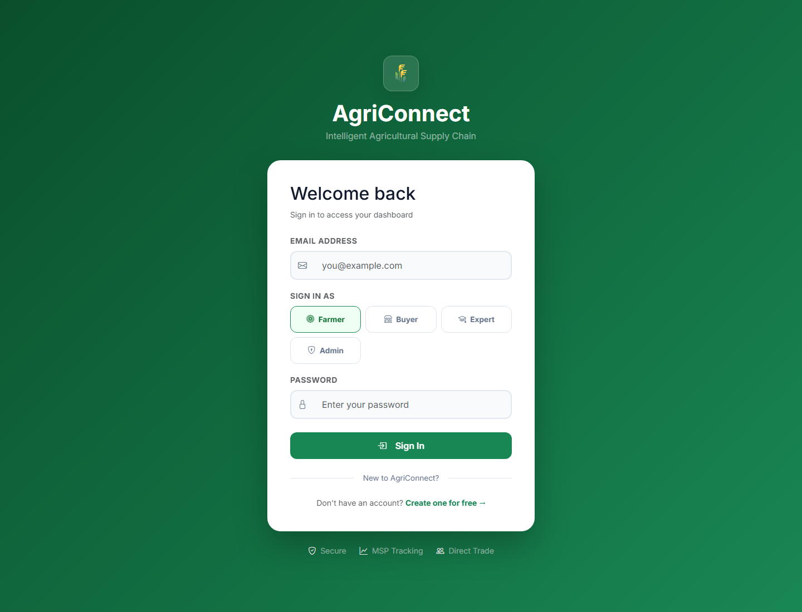

### Public Marketplace

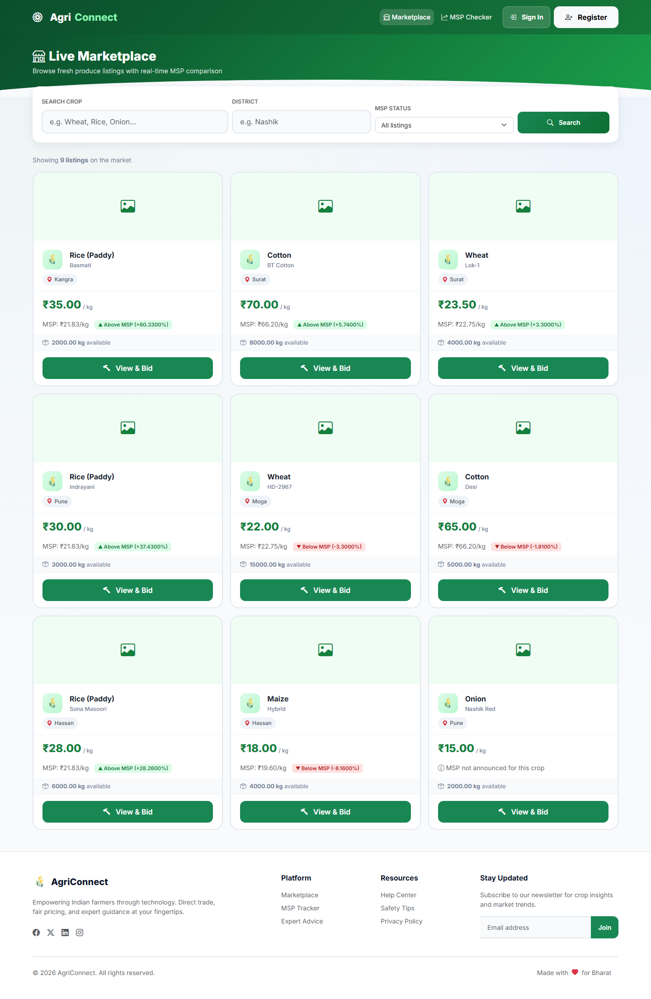

### Listing Details and Bid Form

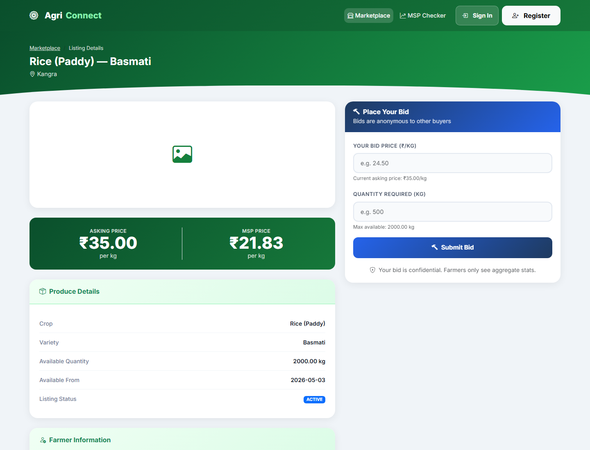

### Farmer Dashboard

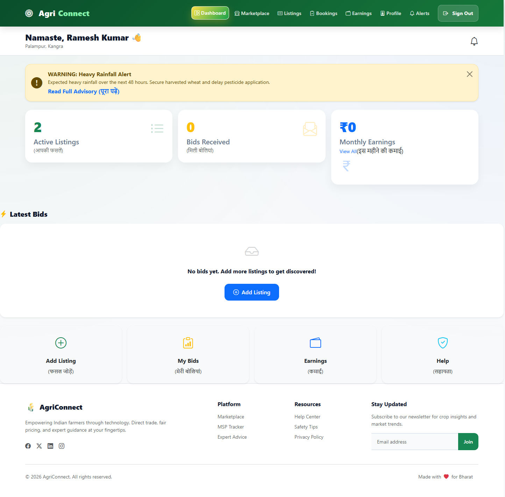

### Farmer Listings

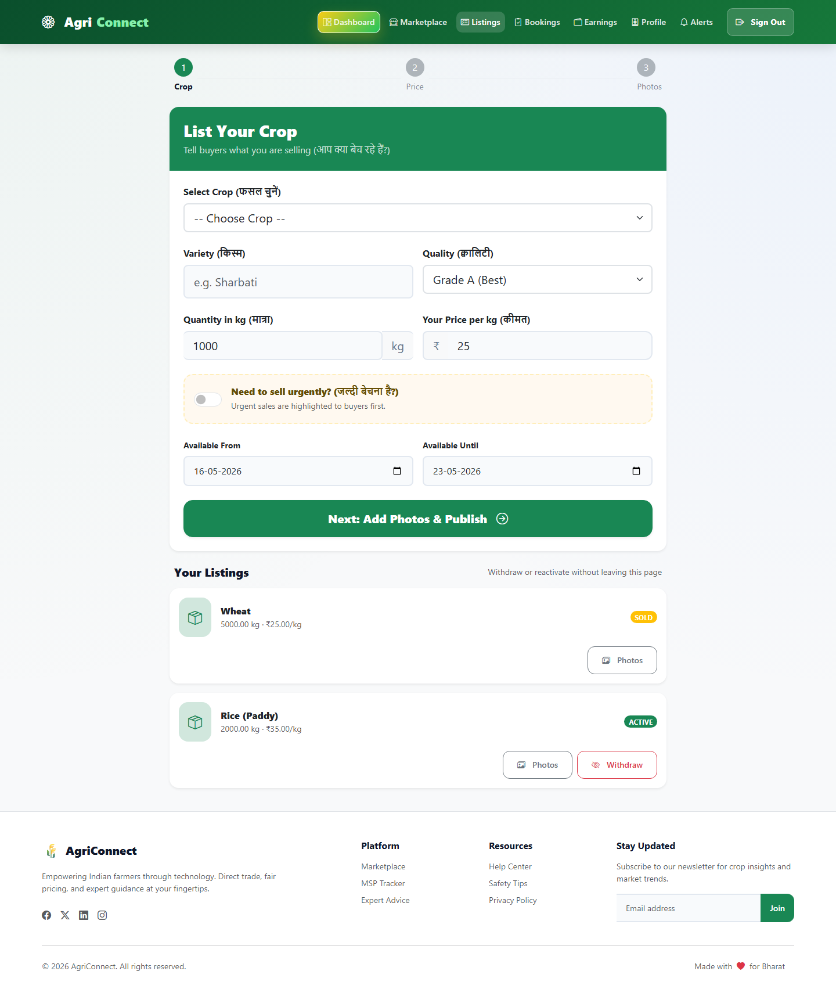

### Farmer Earnings

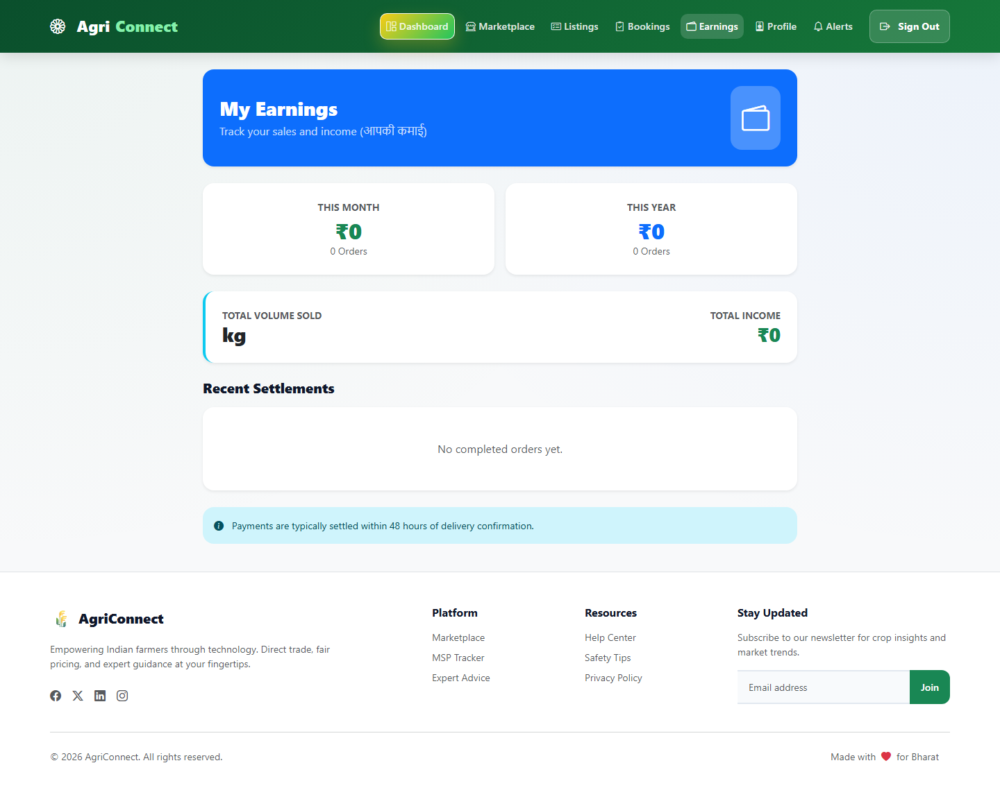

### Buyer Dashboard

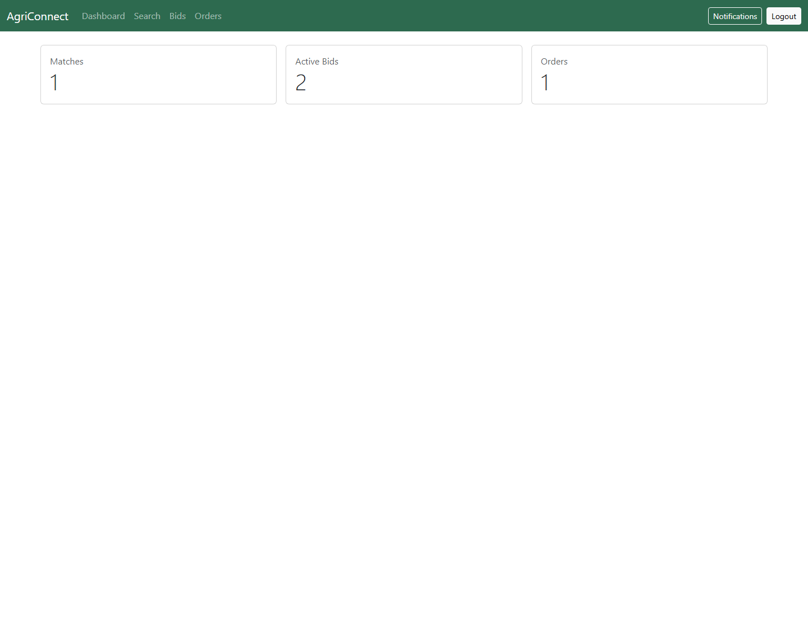

### Buyer Orders and Receipt

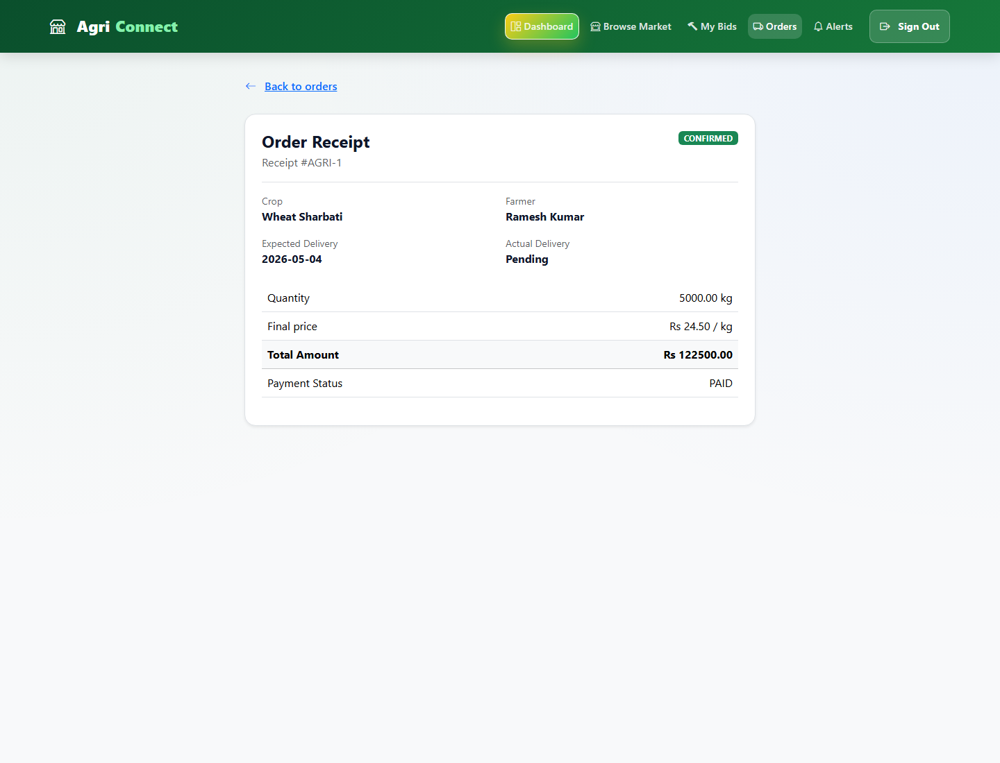

### Admin Dashboard

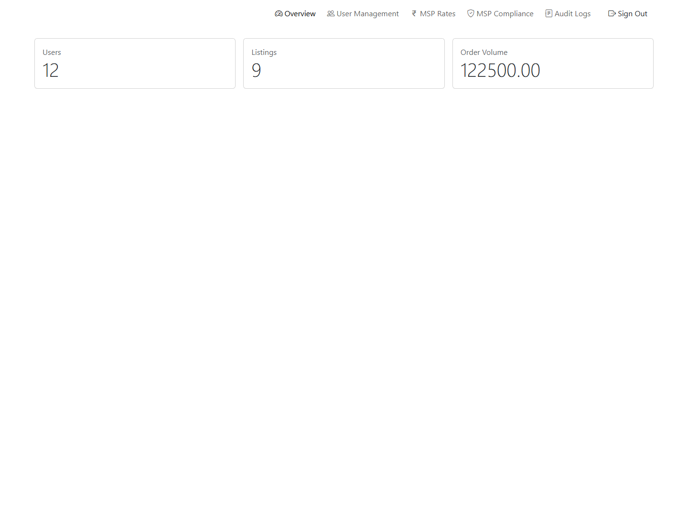

### MSP Compliance

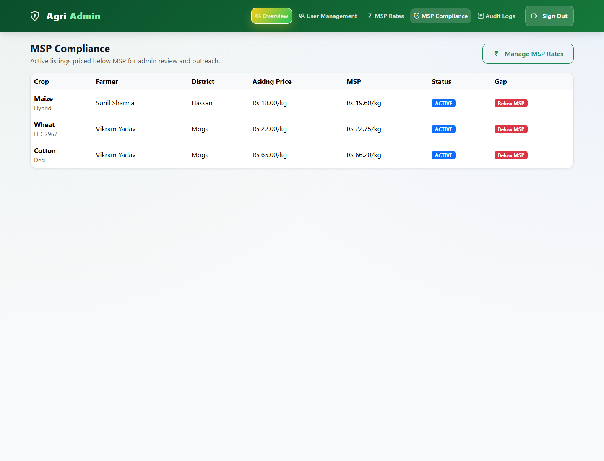

### Expert Advisories

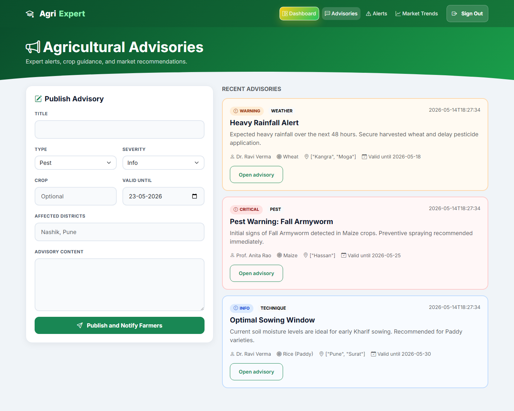

### FPO Dashboard


## Screenshots Required

### Folder Structure

```text
screenshots/
|-- login-page.png
|-- register-page.png
|-- marketplace.png
|-- listing-details.png
|-- msp-checker.png
|-- farmer-dashboard.png
|-- farmer-listings.png
|-- farmer-bookings.png
|-- farmer-earnings.png
|-- farmer-fpo-dashboard.png
|-- buyer-dashboard.png
|-- buyer-bids.png
|-- buyer-orders.png
|-- buyer-receipt.png
|-- admin-dashboard.png
|-- admin-users.png
|-- admin-msp-rates.png
|-- msp-compliance.png
|-- admin-audit.png
|-- expert-dashboard.png
|-- expert-advisories.png
|-- advisory-detail.png
`-- notifications.png
```

### Screenshot Checklist

| Screenshot filename | Page to capture | Why it matters |
| --- | --- | --- |
| `screenshots/login-page.png` | `/auth/login` | Shows authentication UI and role-based login entry |
| `screenshots/register-page.png` | `/auth/register` | Shows user onboarding workflow |
| `screenshots/marketplace.png` | `/web/marketplace` | Demonstrates public listing discovery and filters |
| `screenshots/listing-details.png` | `/web/marketplace/listing/{id}` | Shows listing detail, MSP context, and bid entry |
| `screenshots/msp-checker.png` | `/web/msp-checker` | Highlights MSP compliance functionality |
| `screenshots/farmer-dashboard.png` | `/web/farmer/dashboard` | Shows farmer KPIs, bookings, listings, advisories, and matches |
| `screenshots/farmer-listings.png` | `/web/farmer/listings` | Shows farmer CRUD/listing management |
| `screenshots/farmer-bookings.png` | `/web/farmer/bookings` | Shows bid accept, reject, counter, and order flow |
| `screenshots/farmer-earnings.png` | `/web/farmer/earnings` | Shows financial summary and delivered-order earnings |
| `screenshots/farmer-fpo-dashboard.png` | `/web/farmer/fpo/dashboard` | Shows FPO group, membership, and collective listing features |
| `screenshots/buyer-dashboard.png` | `/web/buyer/dashboard` | Shows buyer KPIs and matchmaking recommendations |
| `screenshots/buyer-bids.png` | `/web/buyer/bids` | Shows bid tracking and counter-offer actions |
| `screenshots/buyer-orders.png` | `/web/buyer/orders` | Shows order tracking from buyer perspective |
| `screenshots/buyer-receipt.png` | `/web/buyer/orders/{id}/receipt` | Shows transaction receipt workflow |
| `screenshots/admin-dashboard.png` | `/web/admin/dashboard` | Shows platform-level monitoring metrics |
| `screenshots/admin-users.png` | `/web/admin/users` | Shows admin verification workflow |
| `screenshots/admin-msp-rates.png` | `/web/admin/msp` | Shows MSP rate management |
| `screenshots/msp-compliance.png` | `/web/admin/msp-compliance` | Shows below-MSP compliance review |
| `screenshots/admin-audit.png` | `/web/admin/audit` | Shows audit logging and accountability |
| `screenshots/expert-dashboard.png` | `/web/expert/dashboard` | Shows expert advisory metrics |
| `screenshots/expert-advisories.png` | `/web/expert/advisories` | Shows advisory publishing and history |
| `screenshots/advisory-detail.png` | `/web/advisories/{id}` | Shows advisory detail page |
| `screenshots/notifications.png` | `/web/notifications` | Shows notification read/unread tracking |

## Future Improvements

- Add a formal `LICENSE` file.
- Add real screenshots to the planned `screenshots/` directory.
- Add Swagger/OpenAPI documentation for REST APIs.
- Add database migration tooling with Flyway or Liquibase.
- Add Testcontainers for MySQL-backed integration tests.
- Add pagination and sorting for marketplace, audit logs, and admin user lists.
- Add richer buyer search using full-text indexes and geospatial distance sorting.
- Add email/SMS delivery for critical advisory notifications.
- Add payment gateway completion flow using the existing Razorpay dependency.
- Add CI workflow badges for build, test, and Docker image publication.
- Add frontend accessibility checks and responsive screenshots.

## Learning Outcomes

This project demonstrates:

- Building a layered Java MVC application with Spring MVC, JSP, services, and DAOs
- Configuring Spring through XML and Java annotations in a WAR-based application
- Designing relational models and Hibernate entity mappings for marketplace workflows
- Implementing role-based authentication and authorization with Spring Security
- Handling REST and server-rendered workflows in the same application
- Managing business transactions for bids, orders, wallet credits, notifications, and audit logs
- Writing scheduled jobs for scoring, matchmaking, and listing expiration
- Running a full Java + MySQL stack with Docker Compose
- Creating unit and integration tests using JUnit, Mockito, MockMvc, H2, and Spring Test

## Contribution

Contributions are welcome for bug fixes, documentation, tests, UI polish, and new marketplace features.

Suggested workflow:

```bash
git checkout -b feature/your-feature-name
mvn test
git commit -m "Add your feature"
git push origin feature/your-feature-name
```

Then open a pull request with:

- Summary of the change
- Screenshots for UI changes
- Test results
- Any database/schema impact


